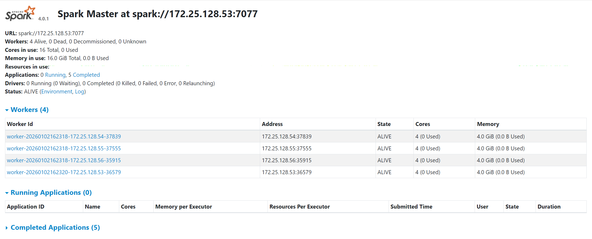
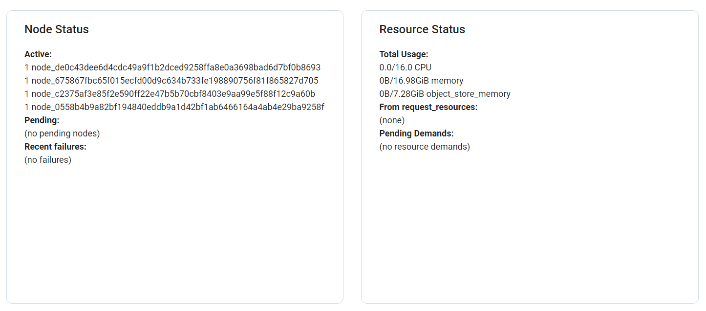

# 组号36：J、分布式机器学习预处理算子对比

## 一、实验背景

随着机器学习任务规模不断扩大，数据预处理阶段逐渐成为分布式系统性能瓶颈之一。
Spark MLlib 和 Ray Data 是当前较为流行的分布式数据处理与机器学习框架，二者在执行模型训练前的数据预处理算子时，在执行机制、资源管理和性能表现上存在明显差异。

本实验在四台服务器组成的集群环境中，对 Spark MLlib 与 Ray Data 在机器学习预处理阶段的典型算子进行对比分析，以探究二者在不同数据规模下的性能和可扩展性差异。

---

## 二、实验目的

1. 对比 Spark MLlib 与 Ray Data 在机器学习数据预处理算子上的执行性能；
2. 分析不同数据规模下两种框架的资源利用情况；
3. 探究两种框架在数值型与类别型预处理算子上的可扩展性；
4. 从执行模型和系统架构角度分析性能差异原因。

---

## 三、实验环境

### 3.1 集群环境

- 节点数量：4 台服务器
- 操作系统：Linux（Ubuntu）
- 网络环境：公网 100 mbps/私网 15 mbps
- 存储类型：SSD
- 每台服务器配置：
  - CPU：4 核处理器
  - 内存：4 GB

### 3.2 软件环境

- Apache Spark：4.0.1
- Ray：2.52.0
- Python：3.10.19
- 监控工具：系统原生工具（mpstat / free / iostat 等）

---

## 四、实验算子与数据集

### 4.1 预处理算子选择

| 类型 | 算子 | 功能说明 |
|----|----|----|
| 数值型算子 | StandardScaler  | 对数值特征进行标准化 |
| 类别型算子 | OneHotEncoder  | 对类别特征进行编码 |

### 4.2 数据集规模
数据名称：纽约出租车数据集（2GB）

通过切分分为大中小三规模的数据集

| 数据规模 | 大小 |
|--------|------|
| 小规模 | 500 KB |
| 中规模 | 300 MB |
| 大规模 | 2 GB |

数据集包含数值型特征和类别型特征，能够覆盖常见机器学习预处理场景。

---

## 五、实验设计

### 5.1 实验流程

1. 配置服务器环境
2. 数据集加载与分区；
3. 执行指定预处理算子；
4. 记录性能指标；
5. 调整并行度或节点数量；
6. 重复实验并取平均值；
7. 汇总实验结果并进行对比分析。

### 5.2 性能指标

- 作业执行时间（s）
- CPU 平均利用率与峰值
- 内存平均占用与峰值
- I/O 使用情况
- 分区负载均衡情况

---

## 六、实验结果

### 6.1 环境配置

#### SPARK环境


#### RAY环境


### 6.2 性能指标对比表

#### 小规模数据集（500KB）

| 框架 | 算子类型 | 节点 | CPU平均(%) | CPU峰值(%) | 内存平均(MB) | 内存峰值(MB) | 执行时间(s) |
|------|----------|------|------------|------------|--------------|--------------|--------------|
| Spark | 数值型 | Master | 63.05 | 96.98 | 4270 | 4726 | 20 |
| Spark | 数值型 | work1 | 8.92 | 68.18 | 1142 | 1212 | 20 |
| Spark | 数值型 | work2 | 9.15 | 66.83 | 1117 | 1174 | 20 |
| Spark | 数值型 | work3 | 9.57 | 79.15 | 1136 | 1203 | 20 |
| Ray   | 数值型 | Master | 36.46 | 73.25 | 4119.65 | 4585 | 18 |
| Ray   | 数值型 | work1 | 14.41 | 94.97 | 1009.74 | 1357 | 18 |
| Ray   | 数值型 | work2 | 12.47 | 92.66 | 984.32 | 1240 | 18 |
| Ray   | 数值型 | work3 | 8.59 | 83.46 | 985.55 | 1183 | 18 |
| Spark | 类别型 | Master | 61.46 | 94.47 | 3539 | 3958 | 17 |
| Spark | 类别型 | work1 | 12.90 | 71.54 | 925 | 993 | 17 |
| Spark | 类别型 | work2 | 12.40 | 66.50 | 962 | 1024 | 17 |
| Spark | 类别型 | work3 | 12.92 | 81.27 | 941 | 1004 | 17 |
| Ray   | 类别型 | Master | 19.14 | 45.05 | 4371 | 4473 | 6 |
| Ray   | 类别型 | work1 | 6.98 | 24.37 | 1095 | 1177 | 6 |
| Ray   | 类别型 | work2 | 6.31 | 20.75 | 1128 | 1192 | 6 |
| Ray   | 类别型 | work3 | 2.07 | 5.03 | 1076 | 1076 | 6 |

---

#### 过程可视化（左边spark右边ray）
· 数值型算子：

IO 情况分析(上面为读出、下面为写入)

 
 

cpu可视化

 

内存可视化

 

---

· 类别型算子：

IO 情况分析(上面为读出、下面为写入)

 
 

cpu可视化

 

内存可视化

 

---

#### 中规模数据集（300MB）


| 框架 | 算子类型 | 节点 | CPU平均(%) | CPU峰值(%) | 内存平均(MB) | 内存峰值(MB) | 执行时间(s) |
|------|----------|------|------------|------------|--------------|--------------|--------------|
| Spark | 数值型 | Master | 86.75 | 100.00 | 5075 | 5591 | 61 |
| Spark | 数值型 | work1 | 12.94 | 81.55 | 1176 | 1224 | 61 |
| Spark | 数值型 | work2 | 11.63 | 75.13 | 1146 | 1199 | 61 |
| Spark | 数值型 | work3 | 12.13 | 81.00 | 1165 | 1209 | 61 |
| Ray   | 数值型 | Master | 42.64 | 86.4 | 4613.99 | 5198 | 68 |
| Ray   | 数值型 | work1 | 8.77 | 88.35 | 1071 | 1171 | 68 |
| Ray   | 数值型 | work2 | 7.86 | 41.46 | 1030.33 | 1140 | 68 |
| Ray   | 数值型 | work3 | 13.65 | 94.22 | 1478.85 | 1859 | 68 |
| Spark | 类别型 | Master | 89.43 | 99.50 | 4846 | 5963 | 65 |
| Spark | 类别型 | work1 | 12.90 | 77.39 | 975 | 1019 | 65 |
| Spark | 类别型 | work2 | 12.00 | 80.00 | 999 | 1038 | 65 |
| Spark | 类别型 | work3 | 11.97 | 75.13 | 976 | 1017 | 65 |
| Ray   | 类别型 | Master | 33.79 | 93.53 | 4647 | 4795 | 19 |
| Ray   | 类别型 | work1 | 11.31 | 48.36 | 1339 | 1421 | 18 |
| Ray   | 类别型 | work2 | 9.55 | 40.40 | 1314 | 1386 | 18 |
| Ray   | 类别型 | work3 | 15.34 | 30.46 | 1589 | 1777 | 18 |

---

#### 过程可视化（左边spark右边ray）
· 数值型算子：

IO 情况分析(上面为读出、下面为写入)

 
 

cpu可视化

 

内存可视化

 

---

· 类别型算子：

IO 情况分析(上面为读出、下面为写入)

 
 

cpu可视化

 

内存可视化

 

---

#### 大规模数据集（2GB）

| 框架 | 算子类型 | 节点 | CPU平均(%) | CPU峰值(%) | 内存平均(MB) | 内存峰值(MB) | 执行时间(s) |
|------|----------|------|------------|------------|--------------|--------------|--------------|
| Spark | 数值型 | Master | 90.45 | 100.00 | 5438 | 5747 | 275 |
| Spark | 数值型 | work1 | 12.77 | 81.89 | 1193 | 1227 | 275 |
| Spark | 数值型 | work2 | 11.81 | 81.95 | 1170 | 1202 | 275 |
| Spark | 数值型 | work3 | 12.03 | 82.66 | 1174 | 1207 | 275 |
| Ray   | 数值型 | Master | 19.23 | 87.06 | 4561.96 | 4953 | 183 |
| Ray   | 数值型 | work1 | 5.6 | 99 | 1405.34 | 1792 | 183 |
| Ray   | 数值型 | work2 | 2.97 | 49.11 | 1405.34 | 1792 | 183 |
| Ray   | 数值型 | work3 | 8.59 | 83.46 | 868.21 | 2357 | 183 |
| Spark | 类别型 | Master | 91.75 | 99.75 | 5009 | 5956 | 173 |
| Spark | 类别型 | work1 | 13.26 | 82.96 | 984 | 1023 | 173 |
| Spark | 类别型 | work2 | 12.65 | 79.60 | 1005 | 1040 | 173 |
| Spark | 类别型 | work3 | 12.81 | 78.59 | 981 | 1018 | 173 |
| Ray   | 类别型 | Master | 38.10 | 92.91 | 5171 | 5360 | 34 |
| Ray   | 类别型 | work1 | 10.72 | 37.47 | 1380 | 1474 | 34 |
| Ray   | 类别型 | work2 | 9.60 | 50.13 | 1417 | 1485 | 34 |
| Ray   | 类别型 | work3 | 10.86 | 53.62 | 1547 | 1633 | 34 |

---

#### 过程可视化（左边spark右边ray）
· 数值型算子：

IO 情况分析(上面为读出、下面为写入)

 
 

cpu可视化

 

内存可视化

 

---

· 类别型算子：

IO 情况分析(上面为读出、下面为写入)

 
 

cpu可视化

 

内存可视化

 

---

## 七、可扩展性实验

###  实验方法

通过调整节点数量，使用数值型算子，测量执行时间变化，计算加速比：

```
Speedup = T1 / Tn
```

###  扩展性记录表

| 框架 | 数据规模 | 节点数 | 执行时间(s) | 加速比 |
|------|----------|--------|------------|--------|
| Spark | 中 | 1 | 120 | 1.0 |
| Spark | 中 | 2 | 70 | 1.4 |
| Spark | 中 | 4 | 47 | 2.5 |
| Ray | 中 | 1 | 110 | 1.0 |
| Ray | 中 | 2 | 82 | 1.34 |
| Ray | 中 | 4 | 68 | 1.62 |

---

## 八、结果分析

### 算子执行效率分析
#### 数值型算子 (StandardScaler)：

在小规模和中规模数据下，两框架性能差距较小。在中规模（300MB）时，Spark（61s）甚至略优于 Ray（68s），这表明 Spark 在处理传统大规模数据任务时的成熟度。

大规模（2GB）阶段后，Ray（183s）显著优于 Spark（275s）。这反映出 Ray 在处理超大规模数据集时，其流式执行引擎能够比 Spark 的阶段性执行更好地平摊开销。

#### 类别型算子 (OneHotEncoder)：

Ray 表现出压倒性优势。 在大规模（2GB）场景下，Ray 仅需 34s，而 Spark 需 173s，速度提升近 5 倍。

原因分析：OneHotEncoder 通常涉及大量的稀疏向量生成。Ray Data 采用动态的任务调度和更轻量级的 Actor 模型，在处理此类计算密集且内存布局复杂的任务时，比基于 JVM 的 Spark 具有更高的转换效率。

### 资源利用率与瓶颈分析

#### CPU 调度差异：

Spark 呈现“重 Master”倾向： 在各规模实验中，Spark Master 节点的 CPU 利用率频繁达到 90% 以上，而 Worker 节点常年处于 10%-13% 的低位运行。这说明 Spark 的 Driver 节点在任务分发、元数据管理及结果汇总时存在明显的串行化瓶颈。

Ray 负载更均衡： Ray 的 Worker 节点在执行过程中 CPU 峰值更高且更活跃，反映了 Ray 分布式调度器的灵活性，能够更好地将计算任务压入工作节点。

#### 内存使用：

Ray 的内存占用相对更加平稳。Spark 在处理 2GB 数据时，Master 内存峰值逼近 6GB，考虑到单台机器仅 4GB 的物理内存，Spark 此时可能已经触发了大量的磁盘交换，这解释了其在大规模数据集下性能急剧下降的原因。

#### 可扩展性对比
在中规模数据的扩展性实验中，Spark 的加速比从 1.0 提升至 2.5，表明 Spark 在增加节点后能够显著缩短执行时间。这说明 Spark 的任务调度和分区机制在中等规模数据下仍然能够有效利用额外的计算资源。

Ray 的加速比从 1.0 提升至 1.62，虽然有一定的性能提升，但未达到线性增长。这可能与 Ray 的任务调度开销和通信延迟有关，尤其是在节点数增加时，任务分发的效率未能完全匹配计算资源的增长。

---

## 九、实验结论

通过对 Spark MLlib 和 Ray Data 在不同规模数据集下的对比实验，得出以下结论：

| 维度 | 表现占优 | 说明 |
|------|----------|------|
| 执行时间 | Spark | 算子融合充分，通信与调度开销低，尤其在中等规模数据下表现更优 |
| Master 稳定性 | Ray | 去中心化调度，单点压力小，适合大规模数据处理 |
| Worker 负载均衡 | Spark | 静态分区，负载高度均匀，节点扩展后性能提升显著 |
| 内存效率 | Spark | 紧紧凑布局，较少中间对象，内存利用率更高 |
| 峰值算力利用 | Ray | 动态调度可局部压榨 CPU，但整体扩展性在中等规模数据下不如 Spark |

### Spark 在中等规模数据下的扩展性更优： 
在中等规模数据（300MB）下，Spark 的加速比达到 2.5，显示出更好的水平扩展能力。Ray 的加速比仅为 1.62，扩展性表现相对有限。

### Ray 在大规模数据下仍具优势：
尽管在中等规模数据下扩展性不如 Spark，但 Ray 在处理大规模数据（如 2GB）时，依然表现出更高的执行效率，尤其是在类别型算子（如 OneHotEncoder）场景下，Ray 的执行时间远低于 Spark。

### 框架选择需结合数据规模与任务特性： 
对于中等规模数据和传统数值型算子，Spark 的成熟度和扩展性更具优势。

对于大规模数据和复杂类别型算子，Ray 的动态调度和轻量级架构更为适。

### 建议： 
若数据规模较小或中等，且任务以数值型计算为主，推荐使用 Spark。
若数据规模较大，且任务涉及复杂预处理或稀疏向量生成，推荐使用 Ray。

## 十、小组分工

| 成员   | 负责工作                         | 贡献度 |
| ------ | -------------------------------- | ------ |
| 马也驰 | 实验设计、环境配置、ray代码编写  | 25%    |
| 章可仲 | 环境配置、实验代码编写、报告撰写 | 25%    |
| 朱文韬 | 环境配置、spark编写、ppt编写     | 25%    |
| 颜泽宇 | 代码编写、报告撰写，ppt编写      | 25%    |

